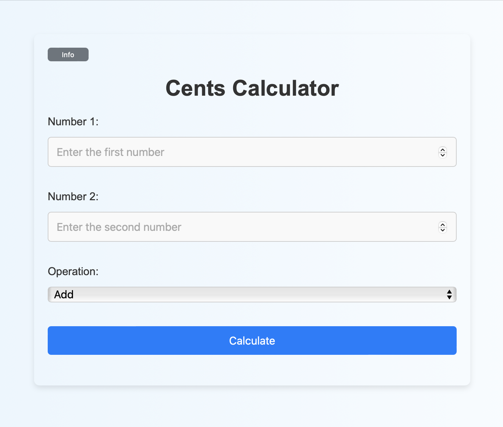

# Simple Web App

This repository contains a simple web application that includes both a frontend and backend. The application performs basic arithmetic operations (addition, subtraction, multiplication, and division) on two input numbers. After the initial calculation, it repeats the operation using the result and the first prime number greater than the larger of the two input numbers. The frontend is a user-friendly interface built with HTML, CSS, and JavaScript, while the backend is developed using Python and FastAPI.


## Project Structure

```bash
simple-web-app/
│
├── backend/
│   ├── __init__.py
│   ├── Dockerfile
│   ├── Dockerfile.test
│   ├── requirements.txt
│   ├── main.py
│   ├── utils.py
│   └── tests/
│       ├── __init__.py
│       ├── test_main.py
│       ├── test_calculate.py
│       └── test_utils.py
│
├── frontend/
│   ├── Dockerfile
│   ├── index.html
│   ├── styles.css
│   └── script.js
│
├── docker-compose.yml
├── .gitignore
└── README.md
```
### Frontend

- **index.html**: The main HTML file containing the structure of the calculator.
- **styles.css**: CSS file for styling the frontend.
- **script.js**: JavaScript file for handling user interactions and communicating with the backend.

### Backend

- **main.py**: The main backend application file built with FastAPI.
- **calculate.py**: This file contains the functions to perform basic arithmetic operations.
- **utils.py**: A utility file containing helper functions like finding the next prime number.
- **tests/**: Directory containing unit tests for the backend.

## Setup and Installation

### Prerequisites

- Docker installed on your machine.

### Running the Application

1. **Build and Run the Application**

   To build and run both the frontend and backend services:

   ```bash
   docker-compose up backend frontend --build
   ```
   The `--build` flag ensures that Docker builds the images from scratch if not needed then can be avoided.

- The frontend will be accessible at `http://localhost:8080`.
- The backend API will be accessible at `http://localhost:8000`.

### Running Tests

To run the backend tests:

```bash
docker-compose run --rm backend_test
```
This command will build the test Docker image using `Dockerfile.test`, run the tests, and then remove the test container.

### Stopping the Application

To stop and remove the containers, networks, and volumes defined in your docker-compose.yml, run:

```bash
docker-compose down
```
### Usage

- Open the web application by navigating to [http://localhost:8080](http://localhost:8080) in your browser.
- Enter two numbers and select an operation (Add, Subtract, Multiply, Divide).
- Click the "Calculate" button to see the result.
- To understand more about how the calculation works, click the "Info" button to display a description.

### Development Workflow

- **Frontend Development**: After modifying the files inside the `frontend/` directory, you can use a local server (e.g., `python3 -m http.server <port_number>`) to preview changes if needed.
- **Backend Development**: After modifying the files inside the `backend/` directory, you can run the backend locally using `uvicorn main:app --reload` after setting the `PYTHONPATH`.
- **Testing**: Ensure all tests pass by running the `pytest` and add new tests to cover new features or changes.

### Screenshot
Here is a screenshot of the website:


